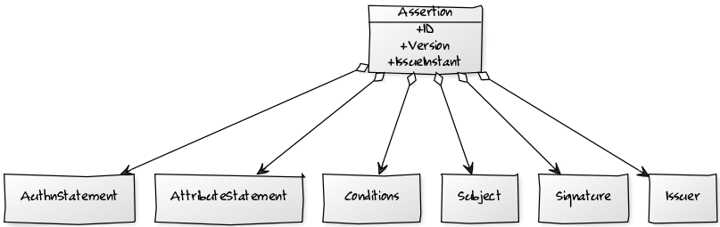

Assertion holds information about the bearer user. It can be signed or encrypted. It contains ``Issuer``, ``Subject``, ``Conditions``,
``AttributeStatement``, and ``AuthnStatement``.

[comment]: <> (  [Assertion|+ID;+Version;+IssueInstant]         )
[comment]: <> (  [Assertion]<>->[Issuer]                        )
[comment]: <> (  [Assertion]<>->[Signature]                     )
[comment]: <> (  [Assertion]<>->[Subject]                       )
[comment]: <> (  [Assertion]<>->[Conditions]                    )
[comment]: <> (  [Assertion]<>->[AttributeStatement]            )
[comment]: <> (  [Assertion]<>->[AuthnStatement]                )

