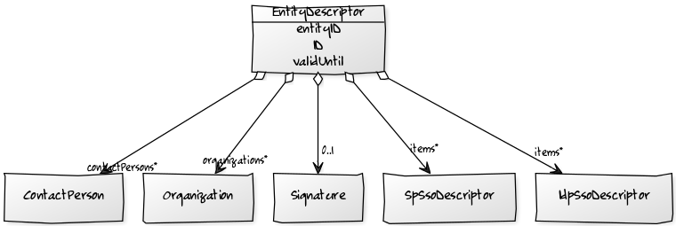
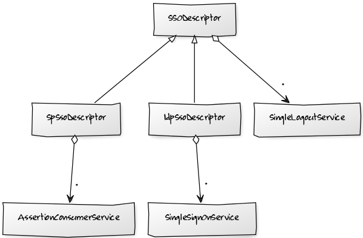
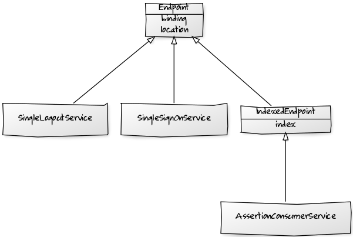

Metadata classes implements the
[SAML metadata schema](http://www.oasis-open.org/committees/download.php/35391/sstc-saml-metadata-errata-2.0-wd-04-diff.pdf). Root
objects of the SAML metadata model are ``EntitiesDescriptor`` and ``EntityDescriptor``.

[comment]: <> (  [EntitiesDescriptor]<>-items*>[EntitiesDescriptor]   )
[comment]: <> (  [EntitiesDescriptor]<>-items*>[EntityDescriptor]     )

``EntitiesDescriptor`` is a collection of ``EntitiesDescriptor``s and ``EntityDescriptor``s.

[comment]: <> (  [EntityDescriptor| entityID; ID; validUntil]           )
[comment]: <> (  [EntityDescriptor]<>-items*>[IdpSsoDescriptor]         )
[comment]: <> (  [EntityDescriptor]<>-items*[SpSsoDescriptor]           )
[comment]: <> (  [EntityDescriptor]<>-0..1[Signature]                   )
[comment]: <> (  [EntityDescriptor]<>-organizations*[Organization]      )
[comment]: <> (  [EntityDescriptor]<>-contactPersons*[ContactPerson]    )

``EntityDescriptor`` is actual party descriptor. It identifies the party by ``entityID``. It has it's own ``ID`` and validity period.
It can be signed with a ``Signature``. It has many ``IdpSsoDescriptor``s and ``SpSsoDescriptor``s that describe the party functionalities
as SP and/or IDP. And it has many ``Organization``s and ``ContactPerson``s.

[comment]: <> (  [SSODescriptor]<>-*>[SingleLogoutService]              )
[comment]: <> (  [SSODescriptor]^-[IdpSsoDescriptor]                    )
[comment]: <> (  [SSODescriptor]^-[SpSsoDescriptor]                     )
[comment]: <> (  [IdpSsoDescriptor]<>-*>[SingleSignOnService]           )
[comment]: <> (  [SpSsoDescriptor]<>-*>[AssertionConsumerService]       )

Both ``IdpSsoDescriptor`` and ``SpSsoDescriptor`` inherits ``SSODescriptor`` that has many ``SingleLogoutService``s, while
``IdpSsoDescriptor`` has many ``SingleSignOnService``s, and ``SpSsoDescriptor`` many ``AssertionConsumerService``s.

[comment]: <> (  [Endpoint| binding; location]^-[IndexedEndpoint| index]        )
[comment]: <> (  [IndexedEndpoint]^-[AssertionConsumerService]                  )
[comment]: <> (  [Endpoint]^-[SingleSignOnService]                              )
[comment]: <> (  [Endpoint]^-[SingleLogoutService]                              )

``EndPoint`` defines a party's service, and it can be ``SingleSignOnService``, ``SingleLogoutService``, and ``AssertionConsumerService``
