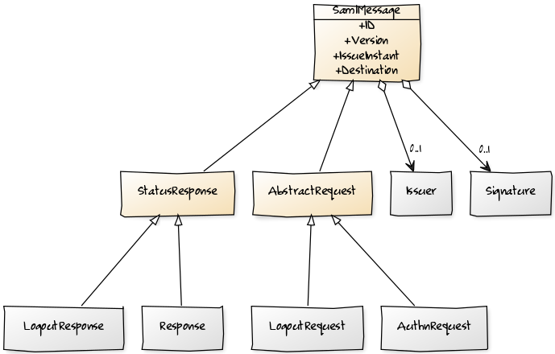
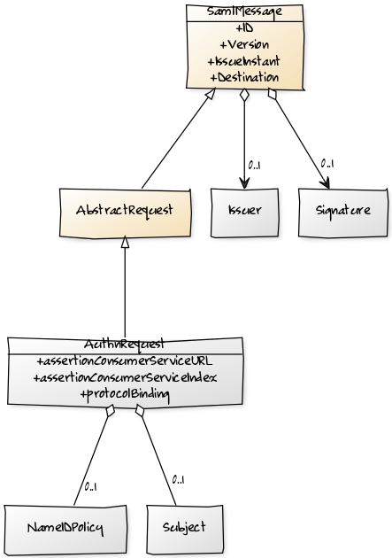
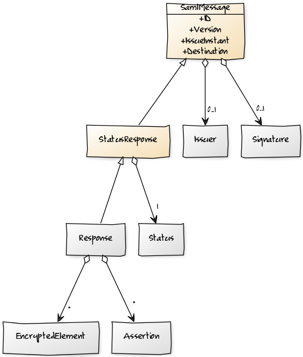
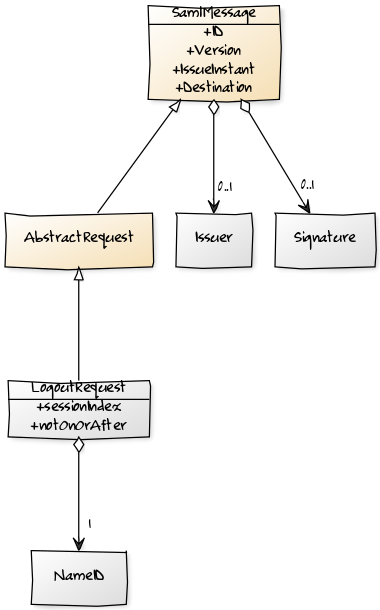
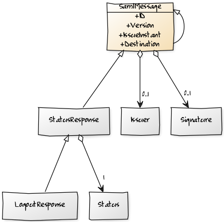

Protocol classes implements the SAML Protocols defined in
[SAML 2.0 core](http://www.oasis-open.org/committees/download.php/35711/sstc-saml-core-errata-2.0-wd-06-diff.pdf). Root
objects of the SAML protocol are:

 * [AuthnRequest](#authnrequest)
 * [Response](#response)
 * [LogoutRequest](#logoutrequest)
 * [LogoutResponse](#logoutresponse)

[comment]: <> (  [SamlMessage|+ID;+Version;+IssueInstant;+Destination{bg:wheat}]^-[AbstractRequest{bg:wheat}]       )
[comment]: <> (  [SamlMessage]^-[StatusResponse{bg:wheat}]                                                          )
[comment]: <> (  [SamlMessage]<>-0..1>[Signature]                                                                   )
[comment]: <> (  [SamlMessage]<>-0..1>[Issuer]                                                                      )
[comment]: <> (  [AbstractRequest]^-[AuthnRequest]                                                                  )
[comment]: <> (  [AbstractRequest]^-[LogoutRequest]                                                                 )
[comment]: <> (  [StatusResponse]^-[Response]                                                                       )
[comment]: <> (  [StatusResponse]^-[LogoutResponse]                                                                 )

Although SAML 2.0 specification does not define common ancessor, in LightSAML all protocol artifacts that can be sent by HTTP-POST or
HTTP-Redirect bindings are abstracted into common ancessor class ``SamlMessage``

## AuthnRequest

``AuthnRequest`` is an artifact sent from SP to IDP to initiate authentication process. It must contain the issuer, and eventually
be signed.

## Response

``Response`` is an artifact sent from IDP to SP with authentication data about the user. It contains the Status indicating the outcome
of the authentication, and if successful, it also usually contains ``Assertion`` with many ``Attribute``s, validity conditions,
and eventually ``NameID``. Assertion in Web Browser SSO SAML profile must be signed. Assertion can also be encrypted.

[comment]: <> (  [SamlMessage|+ID;+Version;+IssueInstant;+Destination{bg:wheat}]^-[StatusResponse{bg:wheat}]    )
[comment]: <> (  [SamlMessage]<>-0..1>[Signature]                                                               )
[comment]: <> (  [SamlMessage]<>-0..1>[Issuer]                                                                  )
[comment]: <> (  [StatusResponse]<>-1>[Status]                                                                  )
[comment]: <> (  [StatusResponse]^-[Response]                                                                   )
[comment]: <> (  [Response]<>-*>[Assertion]                                                                     )
[comment]: <> (  [Response]<>-*>[EncryptedElement]                                                              )

## LogoutRequest

``LogoutRequest`` is sent from one party to another to issue a request for SAML session termination. It must be signed so receiving party
can authenticate the sender. It also must have a ``NameID`` of the user having SAML session terminated, and optionally the ``sessionIndex``
of that session.

[comment]: <> (  [SamlMessage|+ID;+Version;+IssueInstant;+Destination{bg:wheat}]^-[AbstractRequest{bg:wheat}]   )
[comment]: <> (  [SamlMessage]<>-0..1>[Signature]                                                               )
[comment]: <> (  [SamlMessage]<>-0..1>[Issuer]                                                                  )
[comment]: <> (  [AbstractRequest]^-[LogoutRequest|+sessionIndex;+notOnOrAfter]                                 )
[comment]: <> (  [LogoutRequest]<>-1>[NameID]                                                                   )

## LogoutResponse

``LogoutResponse`` is sent by a party as a response to a received ``LogoutRequest``. It redirects the bearer user back to caller with
the information of the outcome of the request. It has simple schema having the status element only.

[comment]: <> (  [SamlMessage|+ID;+Version;+IssueInstant;+Destination{bg:wheat}]^-[SamlMessage]^-[StatusResponse{bg:wheat}]     )
[comment]: <> (  [SamlMessage]^-[StatusResponse]                                                                                )
[comment]: <> (  [StatusResponse]<>-1>[Status]                                                                                  )
[comment]: <> (  [SamlMessage]<>-0..1>[Signature]                                                                               )
[comment]: <> (  [SamlMessage]<>-0..1>[Issuer]                                                                                  )
[comment]: <> (  [StatusResponse]^-[LogoutResponse]                                                                             )

